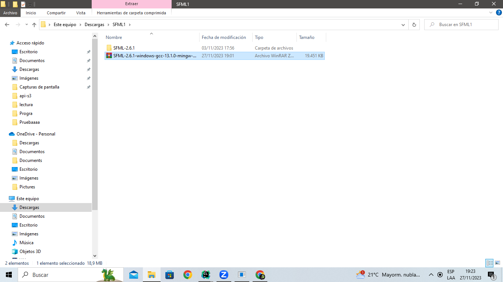
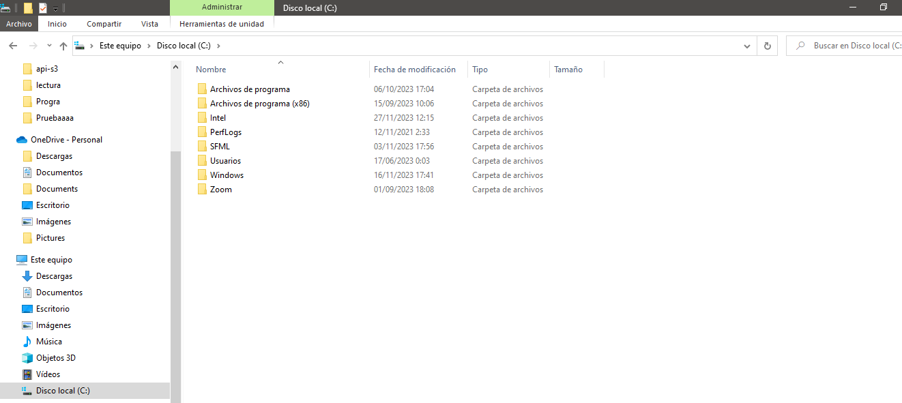
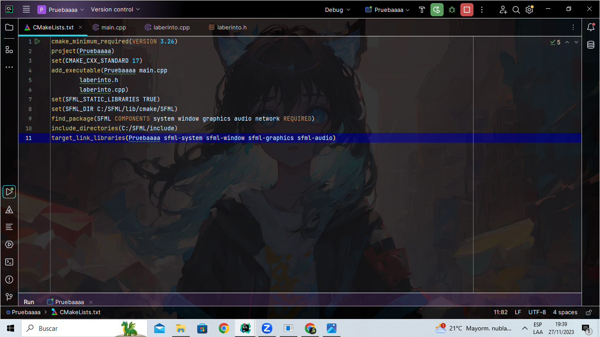
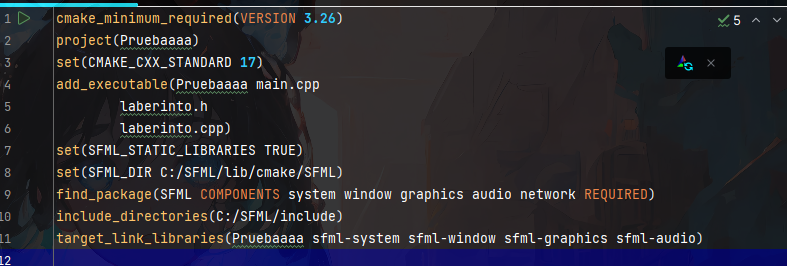
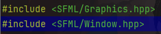

# IMPLEMENTACIÓN DE LA LIBRERIA SFML
### Descarga de la libreria SFML en esta página:
[SFML](https://www.sfml-dev.org/download.php)
##### Recuerde descargar el SFML recomendado para su sistema operativo:
[SFML_Descarga](https://www.sfml-dev.org/download/sfml/2.6.1/)

#### Cuando descargue asi aparecerá en su descargas de su computadora:

#### Lo recomendable es que haga una carpeta y extraiga el zip ahi:

#### Cambiamos el nombre del SFML-2.6.1 a SFML y lo transladamos al disco duro C.

#### Cuando creemos un proyecto en CLionProjects donde queramos utilizar la libreria SFML aplicaremos en el cMakeList.txt:

##### En vez de Pruebaaaa pondremos el nombre del proyecto.

##### Recuerde darle click a ese Lood cmake changes.

#### Implementa este encabezado en los archivos que quiera usar en el proyecto para poder usar la libreria.

## Video de presentación de nuestro proyecto:
[Video_de_exposición](https://www.youtube.com/watch?v=QsVg6Gwcgsk&ab_channel=Jos%C3%A9AlonsoRodr%C3%ADguezMoscoso)
