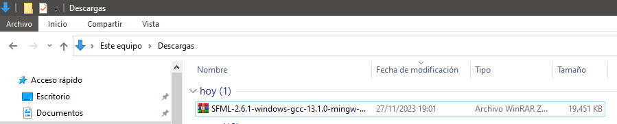

# IMPLEMENTACIÓN DE LA LIBRERIA SFML
### Descarga de la libreria SFML en esta página:
[SFML](https://www.sfml-dev.org/download.php)
##### Recuerde descargar el SFML recomendado para su sistema operativo:
[SFML_Descarga](https://www.sfml-dev.org/download/sfml/2.6.1/)

[Video_de_exposición](https://www.youtube.com/watch?v=QsVg6Gwcgsk&ab_channel=Jos%C3%A9AlonsoRodr%C3%ADguezMoscoso)
